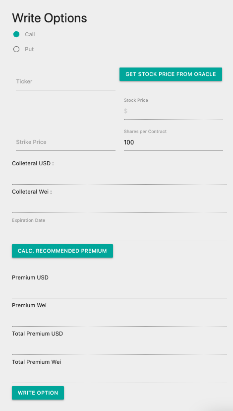
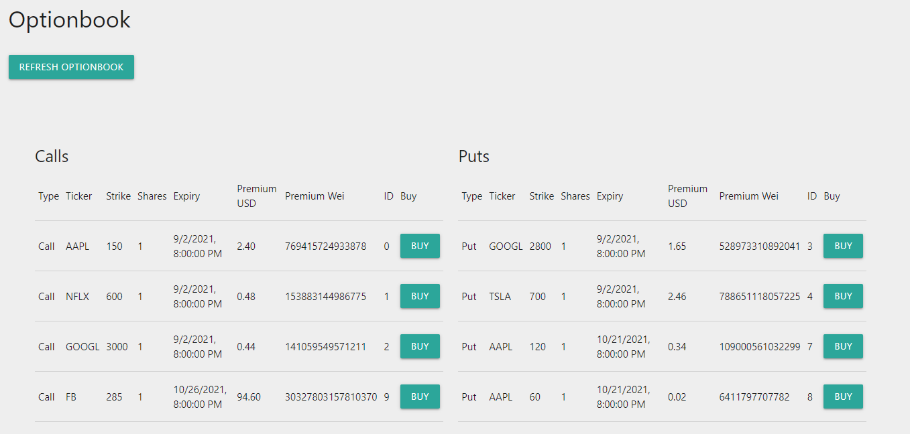

#### *"it's a decentralized stock option clearing house!"* - some blockchain developer
#### [optionblock.app](https://storage.googleapis.com/www.optionblock.app/index.html)
---

## Table of Contents
* [Overview](#overview)
* [Application Logic](#application-logic)
* [Dependencies](#dependancies)
* [Frontend UI](#frontend-ui)
* [Option Contract](#option-contract)
* [Oracle Contract](#oracle-contract)
* [Backend API](#backend-api)
* [Team](#team)

---

## Overview

Option Block is a decentralized stock option clearing house.<br>

It frees people from the centralized stranglehold of national option clearing houses and gives freedom to write uncovered calls and puts against U.S. stocks.<br>

Currently, OptionBlock is a demo it means that all options contracts are trading in tETH (Test ETH) on the Ropsten testnet. tETH has no value. All contracts are settled in *cash* (tETH) and no shares or moneys are exchanged in this demo.<br>

In this demo only a few stocks are optionable: AAPL, GOOGL, FB, NFXL, AMZN, NVDA, and TSLA. All options are American style, which means you can exercise them when ever you want.<br>

OptionBlock is enabled by the DeFi technology, powered by Ethereum Smart Contracts and in-house Data Oracles.<br>

---

## Application Logic


---

## Dependancies

### Frontend
1. [Node.js](https://nodejs.org/en/) - JavaScript runtime built on Chrome's V8 JavaScript engine
2. [Web3.js](https://web3js.readthedocs.io/en/v1.4.0/) - collection of libraries that allow you to interact with a local or remote ethereum node using HTTP, IPC or WebSocket.
3. [MetaMask](https://metamask.io/) - crypto wallet & gateway to blockchain apps

### Backend
1. [Flask](https://flask.palletsprojects.com/en/2.0.x/) - micro web framework written in Python
2. [yfinance](https://pypi.org/project/yfinance/) - Yahoo! Finance market data downloader
3. [Quandl](https://www.quandl.com/) - source for financial, economic and alternative datasets
4. [SciPy](https://www.scipy.org/) - Python-based ecosystem of open-source software for mathematics, science, and engineering

### Option
1. [Solidity](https://docs.soliditylang.org/en/v0.8.7/) via [Remix](https://remix.ethereum.org/) - object-oriented programming language for writing smart contracts

### Oracle
1. [Node.js](https://nodejs.org/en/) - JavaScript runtime built on Chrome's V8 JavaScript engine
2. [Solidity](https://docs.soliditylang.org/en/v0.8.7/) via [Remix](https://remix.ethereum.org/) - object-oriented programming language for writing smart contracts
3. [Web3.js](https://web3js.readthedocs.io/en/v1.4.0/) - collection of libraries that allow you to interact with a local or remote ethereum node using HTTP, IPC or WebSocket.
4. [node-fetch](https://www.npmjs.com/package/node-fetch) - light-weight module that brings window.fetch to Node.js
5. [ethereum-tx](https://github.com/ethereumjs/ethereumjs-tx) - Ethereum via Node.js
6. [Express](https://expressjs.com/) - web framework for Node.js
7. [Cron](https://www.npmjs.com/package/node-cron) - task scheduler in pure JavaScript for node.js based on GNU crontab
---

## Installation
There is no installation required to try the service. However, if you want to deploy the service from the source code, some dependancies need to be installed first:

### Node.js
All Node.js dependancies can be installed through [<code>npm</code>](https://www.npmjs.com/) (Node Package Manager). <code>npm</code> comes with Node.js which can be installed from [nodejs.org](</code>). 

To install all the packages required for the front end or oracale, <code>cd</code> into the respective folder and run:

```bash
npm install
```

### Python
The backend API runs on Flask, which is a Python service. All requirements are available in the <code>[requirements.txt](oracle/stock_price_api/requirements.txt)</code> file. To install the requirements from your <code>conda</code> environment, <code>cd</code> into the <code>[oracle/stock_price_api](oracle/stock_price_api)</code> directory and run:

```python
conda install --file requirements.txt
```

### Solidity
All Solidity smart contracts are developed, built and deployed in [Remix](https://remix.ethereum.org/). The contracts in the demo are deployed on the [Ropsten](https://ropsten.etherscan.io/) testnet. *Make sure to update the contract addresses of the Solidity option contracts and oracles in <code>[dapp.js](frontend/scripts/dapp.js)</code>, so that they are referenced correctly.

### Deploying on the web
Alternatively, the backend API, oracle and frontend services can be deployed on the web. There following are instructions for deployment on [Google Cloud Compute](https://cloud.google.com/) platform in the following order:

1. Oracle:  <code>[google.cloud.com/appengine](https://cloud.google.com/appengine/docs/standard/nodejs/building-app)</code>
2. Options and oracle smart contract: [Remix](https://remix.ethereum.org/)
3. Backend API: <code>[google.cloud.com/appengine](https://cloud.google.com/appengine/docs/standard/python3/building-app)</code>
4. Frontend: <code>[codelabs.developers.google.com](https://codelabs.developers.google.com/codelabs/cloud-webapp-hosting-gcs#0)</code>

### MetaMask
In any case [MetaMask](https://metamask.io/) must be installed in your browser. MetaMask is a wallet providing signatory services to transact on the Ethereum blockchain witout revealing sensitive financial information. MetaMask can be installed as a browser app through your browsers app store. *After installing MetaMask, make sure to connect to the Ropsten testnet*. You will also need some Ropsten Test Eth to transact. Here is a list of the most popular faucets:

1. https://faucet.ropsten.be/
2. https://faucet.dimensions.network/
3. https://faucet.metamask.io/

---

## Frontend UI

The front end was developed in [Node.js](https://nodejs.org/en/) using the [Web3.js](https://web3js.readthedocs.io/en/v1.4.0/) library to connect to the Ethereum blockchain via [MetaMask](https://metamask.io/). The frontend was styled using [Materialize](https://materializecss.com/) library for a responsive UX. 

### Portfolio
Displays user's current long and short stock option positions. User is able to interact with current positions via <code>Exercise</code> and <code>Cancel</code> buttons. Long options can be exercised at any point (if they are in the money) by clicking <code>Exercise</code>. Short options, which have not been sold yet can be canceled (removed from the marketplace) by clicking <code>Cancel</code>.


### Write Options
This module lets user write options for select stocks. User selects whether to write a <code>Call</code> or a <code>Put</code>. 
* Ticker is selected from a dropdown menu titled <code>Ticker</code>
* Stock price is pulled from an in-house [Oracle Smart Contract](oracle) by clicking the <code>Get Stock Price from Oracle</code> button
* User is then required to enter the <code>Strike Price</code> and <code>Shares per Contract</code>.
* Collateral needed to secure the value of the option is then calculated : <code>Shares per Conract * Strike Price</code>
* User is then required to select option expiry date from the <code>Expiration Date</code> calendar selector
* Option premium that the option writer desires to charge is then retrived from backend [Flask API](oracle/stock_price_api) by clicking <code>Calc. Recommended Premium</code> button. The option premium can be adjusted based on the user preference and market conditions. The option premium will automaticall recalculate if the strike price or number of shares per contract is changed.



### Orderbook
Displays current open orders. The display is split into <code>Call</code> and <code>Put</code> options. Option buyer can buy options by clicking <code>Buy</code> button next the the desired option contract. The display will update when the order is processed.



**Reminder! This is a demo, a beta, a MVP. So sometimes the server is slow and the view will requires a few seconds to refresh, and sometimes the view will not refresh automatically at all. Please refresh the views (by clicking <code>Refresh Portfolio</code> or <code>Refresh Optionbook</code>) or reshresh the entire page, if the data on the page is weird.**

---

## Option Contract

The Option contract encodes the logic of an American Call or American Put option *naked* option. For the purpose of a demonstration, when writing naked Call, we ask the writer to produce only <code>Strike * Number of Shares</code>, thus limiting the potential profit for the buyer to 100% stock movement. This in effect results in a *synthetic vertical spread* instead of a traditional *naked* option.

The Option Contract is written in [Solidity](https://docs.soliditylang.org/en/v0.8.7/) using the [Remix](https://remix.ethereum.org/) IDE and is deployed on the Ethereum Ropsten Testnet : <code>"0xC4125a834a922B56787D817D707FBDFaF0B74d9A"</code>.

### Option struct

Option details for each option are stored in the form of a struct:
```C#
struct option {
    uint strike;               //Price in USD option
    uint ethPriceAtTimeOfWrite;//Eth Price in USD at time of write
    uint premium;              //Fee in contract token that option writer charges
    uint expiry;               //Unix timestamp of expiration time
    uint amount;               //Amount of tokens the option contract is for
    bool isCallOption;         //Is this a call option
    bool exercised;            //Has option been exercised
    bool canceled;             //Has option been canceled
    uint id;                   //Unique ID of option, also array index
    uint latestCost;           //Helper to show last updated cost to exercise
    address payable writer;    //Issuer of option
    address payable buyer;     //Buyer of option
    string ticker;             //Ticker of the stock
}
```
Most of the fields are the same as standard stock options, such as strike price, premium, expiration datetime, amount and whether the option is a call option or a put option. We have two booleans to keep track of the state of the option (exercised/canceled). And finally, we store the addresses of the writer and the buyer for ethereum transactions between the two parties.

All options are stored in a public array on the Options contract, and users can view the details of each contract using its id (array index).

### Writing, Buying, Exercising an Option

The Options contract has a few public methods for users to interact with the options:

#### 1. Writing an Option

```C#
function writeCallOption(uint strike, uint premium, uint shares, uint expiry, uint tknAmt, string memory ticker) public payable;
```

Allows a user to write a call option. Users will need to provide the strike price of the underlying stock (USD * 100), the premium of this option, the expiration date (unix timestamp), the amount of ethereum this option is for, and the stock's ticker symbol. In addition, users will need to deposit enough ethereum as collateral to this contract; the amount of ethereum sent to the contract should be consistent with the token amount parameter.

```C#
function writePutOption(uint strike, uint premium, uint shares, uint expiry, uint tknAmt, string memory ticker) public payable;
```

Similar to writeCallOption, this function allows users to write covered put options.

#### 2. Buying an Option

```C#
function buyOption(uint ID) public payable;
```

If an option is still available on the market, i.e. the option has not been canceled, is not expired, buyer is null, a user can use the above function to buy the option. The user will need to send the corresponding eth as indicated by the premium field of the option. The premium will be sent to the writer of the option right away.

#### 3. Canceling an Option

```C#
function cancelOption(uint ID) public;
```

Users can cancel options that they have written and haven't been bought via the above method. The collateral eth will be refunded to the writer.

#### 4. Exercising an Option

```C#
function exercise(uint ID) public;
```

Users have the choice to exercise options that they bought previously, given that the option is not expired, using the exercise method. The value of the option is calculated as follows:
* Call options: (current stock price - strike price) * number of shares / current eth price
* Put options: (strike price - current stock price) * number of shares / current eth price
Users will receive eth equal to the value of the option, up to the collateral deposited by the writer. Any remaining eth will be returned to the writer.

#### 5. Utility functions
```C#
function updatePrices() public;
function getAllAvailableOptions() public view returns (option[] memory);
function getMyOptions() public view returns (option[] memory);
function getOptionsBought() public view returns (option[] memory);
```

In addition, the Options contract provide a few utility methods for the front-end as well as the user to view the options on the market.

---

## Oracle Contract

Oracle Contract provides a closing stock price data feed to the Options Contract. It also supplies data to the frontend in order to provide the user with the correct data at the time of writing and buying the options as well as when viewing the portfolio. The Oracle also provides ETH-USD datafeed. The Oracle Contract is written in [Solidity](https://docs.soliditylang.org/en/v0.8.7/) via [Remix](https://remix.ethereum.org/), and is deployed on the Ethereum Ropsten Testnet :

```js
    AAPL   = '0x57960D9E1244deB9181BdC2a6B34968718fed1A4'
    GOOGL  = '0xBC32E17e2a72F6e97Aa0cA70FfCE9E951E6ef30c'
    FB     = '0xdc2687b1e955078E12317EAcC7AEb3635E299970'
    NFLX   = '0xB7703E97FeAC6d2377a8107190F7a057A54a6346'
    AMZN   = '0x95da0ecE375333e723A5a4387A3EfdCf60E3273c'
    NVDA   = '0x9Bc082c47B2Cd671B633C86BCF3b53f577968bB9'
    TSLA   = '0xD3DF5bEaA0C0D89dC4156870b6913C7EA8F74c23'
    ETHUSD = '0x7744b083407c57E8DDCd32396699A7D8C6cc305a'
```

The Oracle service is written in [Node.js](https://nodejs.org/en/) and is runing as an [Express](https://expressjs.com/) app and is refreshed every 20 minutes via a [Cron](https://www.npmjs.com/package/node-cron) job.

Connection to the Ethereum Ropsten Testnet is provided by [Infura](https://infura.io/) via [Web3.js](https://web3js.readthedocs.io/en/v1.4.0/), while the transactions are parsed via [ethereum-tx](https://github.com/ethereumjs/ethereumjs-tx) Node.js module. [node-fetch](https://www.npmjs.com/package/node-fetch) handles all imported modules.

Example of an Oracle Contract:

```C#
contract StockOracleAAPL {
    
    /*storage*/
    uint public close;
    string public ticker = "AAPL";
    address public owner;

    /*contructor*/
    constructor() public {
        owner = msg.sender;
    }
    
    /*function setting price*/
    function setClose(uint _close) public {
        require(owner == msg.sender, "You are not the administrator of this oracle!");
        close = _close;
    }
    
    /*function getting the price*/
    function getClose() public view returns (uint) {
        return close;
    }
}
```

The contract is updated with a new <code>Close</code> price by sending the value to the <code>setClose()</code> function, which can be accessed only by the contract administrator. The contract administrator address is hard coded in the <code>[oracle.js](oracle/oracle.js)</code> file for convinience of running a demo, but in production should always be hidden.

The most up-to-date <code>Close</code> price can be retrieved by calling <code>getClose()</code> function or by simply calling the <code>close</code> public variable.

---

## Backend API

The backend API was designed to retrieve necessary data for Oracle Contract and Option premium calculation. The API is developed using [Flask](https://flask.palletsprojects.com/en/2.0.x/) web framework. Stock data is obtained using <code>[yfinance](https://pypi.org/project/yfinance/)</code> library. Risk Free Rate for the options calculations is retrieved from [Quandl](https://www.quandl.com/). While [Black Scholes](https://www.cs.princeton.edu/courses/archive/fall09/cos323/papers/black_scholes73.pdf) option premium calculation is performed with assistance of [SciPy](https://www.scipy.org/) module. The API is hosted on Google Cloud App server and is accessible via URL: <code>[option-block.ue.r.appspot.com/](https://option-block.ue.r.appspot.com/)</code>.

### Closing price

Closing price for the Oracle Contract is retrived via the following Flask URL query:

```html
/quote?symbol=<TICKER>
```

Where 

> *symbol* = stock ticker

### Option premium - Black-Scholes

Black-Scholes option premium can be retrieved with the following query:

```html
/option_bs/<symbol>/<price>/<strike>/<mat_date>/<rf>/<call_put_flag>
```

Where:

> *symbol* = stock ticker <br>
> *price* = stock price, where stock price multipled by 100 (ex. 145.20 = 14520) <br>
> *strike* = strike price, where stike price multipled by 100 (ex. 145.20 = 14520) <br>
> *mat_date* = maturity date (YYYY-MM-DD) <br>
> *rf* = risk free rate in basis points (ex. 0.25% = 25) <br>
> *call_put_flag* = for call pass "c", for put pass "p" <br>

### Option premium - Market Data

The fastest way to get the option premium data is to obtain market data for options with similar strike price and expiry:

```html
/option_yf/<symbol>/<strike>/<mat_date>/<call_put_flag>
```

Where:

> *symbol* = stock ticker <br>
> *strike* = strike price, where stike price multipled by 100 (ex. 145.20 = 14520) <br>
> *mat_date* = maturity date (YYYY-MM-DD) <br>
> *call_put_flag* = for call pass "c", for put pass "p" <br>

---

## Team

* [Fernando Bastos](https://www.linkedin.com/in/fdobastos/)
* [Willy Feid](https://www.linkedin.com/in/william-feid/)
* [Yourik Hacoupian, Ph.D.](https://www.linkedin.com/in/yhacoupian/)
* [Illya Nayshevsky, Ph.D.](https://www.linkedin.com/in/illyanayshevskyy/)
* [Jay Yu](https://www.linkedin.com/in/zhe-yu-92425a127/)
* [Tyler Wallace](https://www.linkedin.com/in/tyler-wallace-5904b757/)
